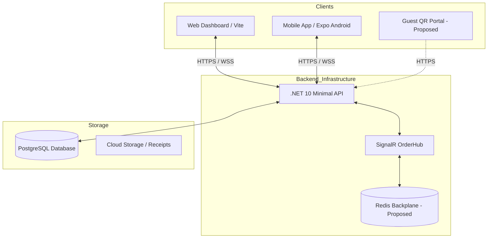
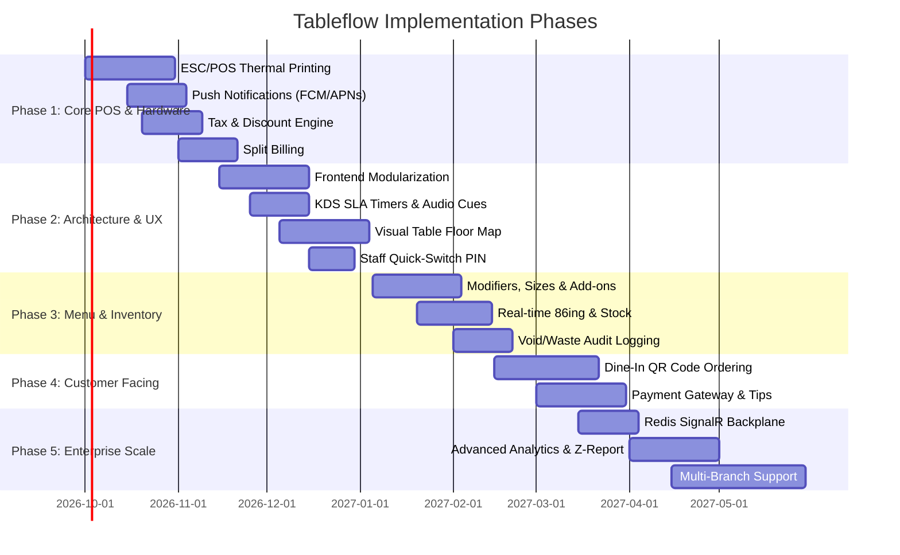

# Tableflow: Product & Engineering Roadmap

This document outlines the strategic and technical roadmap for transitioning **Tableflow** from its current functional MVP into a production-grade, enterprise-ready restaurant POS (Point of Sale) and management ecosystem.

---

## 1. Executive Summary & Current Architecture

Tableflow currently features a solid, modern foundation:
- **Backend**: .NET 10 Minimal API with Entity Framework Core, PostgreSQL, JWT Authentication, and real-time SignalR WebSockets.
- **Web App**: React 18 + TypeScript + Vite dashboard with role-based views (Waiter, Kitchen, Reception/Cashier, Admin) and an offline-first interactive browser demo.
- **Mobile App**: React Native / Expo standalone Android & iOS app with local draft persistence and resilient reconnect logic.
- **Workflow**: Linear progression (`New → Preparing → Ready → Served → Paid / Closed`).

### Current Technical Limitations & Gaps
1. **Monolithic Frontend Files**: [App.tsx](file:///c:/Users/Administrator/Documents/ChatGPT/Restaurant%20Project/mobile/App.tsx) (~25 KB) and [main.tsx](file:///c:/Users/Administrator/Documents/ChatGPT/Restaurant%20Project/web/src/main.tsx) (~31 KB) contain all screens, components, and logic in single files.
2. **Missing Hardware Integrations**: No direct ESC/POS Bluetooth, USB, or Network thermal receipt printing for KOTs (Kitchen Order Tickets) or customer bills.
3. **No Background Push Notifications**: Mobile alerts only trigger while the application is active in the foreground ([mobile/README.md](file:///c:/Users/Administrator/Documents/ChatGPT/Restaurant%20Project/mobile/README.md#L24)).
4. **Single-Instance API Constraint**: SignalR uses in-memory hub connections without a Redis backplane; running multiple API instances drops cross-instance real-time state broadcasts.
5. **Rigid Order & Billing Workflow**: Missing item modifiers/sizes, order voids with audit reasons, bill splitting, and automated tax/service charge calculations.

---

## 2. Phased Roadmap

---

### Phase 1: Frontline Operations & POS Essentials
*Objective: Deliver critical features required for a live commercial restaurant pilot.*

#### 1.1 ESC/POS Thermal Receipt & KOT Printing
- **Mobile (Bluetooth)**: Print Kitchen Order Tickets (KOT) directly from waiter phones to Bluetooth 58mm/80mm thermal printers using standard ESC/POS commands.
- **Web (Network/USB)**: Web Print API or raw network socket printing to fixed kitchen and cashier printers.
- **Templates**:
  - *KOT Template*: Order #, Table #, Waiter Name, Timestamp, Items, Item Notes.
  - *Bill Template*: Business Header/Tax ID, Itemized List, Subtotal, Taxes, Service Charge, Total, UPI Dynamic QR Code, Footer greeting.

#### 1.2 Background Push Notifications (FCM / APNs)
- Register device push tokens on staff login (stored in a new `DeviceTokens` table).
- Integrate Firebase Cloud Messaging (FCM) / Apple Push Notification service (APNs).
- Trigger persistent lock-screen vibrations and ringtones when an order status transitions to `Ready`.

#### 1.3 Tax & Discount Calculation Engine
- Update [Models.cs](file:///c:/Users/Administrator/Documents/ChatGPT/Restaurant%20Project/server/Restaurant.Api/Models.cs) to configure customizable tax rules (e.g., GST: 2.5% CGST + 2.5% SGST, VAT, or State Tax).
- Support percentage and flat-rate discounts with mandatory Manager/Admin authorization and reason tracking.

#### 1.4 Split Billing & Dynamic Payment Reconciliation
- Provide cashiers with three bill splitting mechanisms:
  1. *Split Equally*: Divide total amount across $N$ guests.
  2. *Split by Item*: Allocate specific ordered dishes to separate sub-bills.
  3. *Custom Amounts*: Partial payments across multiple tenders (e.g., ₹500 Cash + ₹1200 UPI).
- Generate dynamic UPI QR codes on the bill screen matching the exact outstanding balance.

---

### Phase 2: Architecture Refactoring & Frontend UX
*Objective: Transform monolithic source code into maintainable, scalable modular components.*

#### 2.1 Codebase Modularization
- **Mobile ([mobile/App.tsx](file:///c:/Users/Administrator/Documents/ChatGPT/Restaurant%20Project/mobile/App.tsx))**:
  - Adopt **React Navigation** or **Expo Router**.
  - Extract role screens: `WaiterScreen`, `KitchenScreen`, `CashierScreen`, `AdminScreen`.
  - Extract reusable components: `TableCard`, `OrderTicket`, `CartModal`, `QuantityStepper`.
  - Extract custom hooks: `useOrders`, `useSignalRHub`, `useOfflineSync`.
- **Web ([web/src/main.tsx](file:///c:/Users/Administrator/Documents/ChatGPT/Restaurant%20Project/web/src/main.tsx))**:
  - Modularize into `/src/features/{waiter, kitchen, cashier, admin}`.
  - Extract state into a centralized store (e.g., Zustand or React Context).

#### 2.2 Kitchen Display System (KDS) Upgrades
- **SLA Timers**: Color-code kitchen tickets dynamically based on elapsed time:
  - 🟢 **Normal**: < 10 minutes
  - 🟡 **Warning**: 10 – 15 minutes
  - 🔴 **Delayed**: > 15 minutes
- **Audio Chimes**: Distinct browser and native sound alerts on new incoming tickets.
- **Station Routing**: Route items to specific kitchen screens (e.g., *Grill*, *Bar/Beverages*, *Dessert*).

#### 2.3 Visual Table Floor Map & Table Transfers
- Visual interactive floor plan supporting sections (Main Hall, Terrace, Bar, Private Dining).
- Live table status color indicators: *Vacant*, *Occupied*, *Food Ready*, *Bill Requested*.
- Support **Table Transfers** (moving an active session from Table 2 to Table 5) and **Table Merges** (combining Tables 3 & 4 for large groups).

#### 2.4 Staff Quick-Switch (PIN Unlock)
- 4-digit numeric PIN authentication for shared station terminals (allows switching between staff in < 2 seconds without typing full credentials).

---

### Phase 3: Menu Customization & Inventory Controls
*Objective: Handle complex real-world culinary orders and prevent stock shortages.*

#### 3.1 Item Modifiers & Portion Sizing
- Extend `MenuItem` entity:
  - **Portion Sizes**: Half / Full, Small / Medium / Large (with individual price points).
  - **Modifier Groups**: Required (e.g., meat temperature: Rare, Medium, Well-Done) or Optional (e.g., extra cheese, sauce on the side).

#### 3.2 Real-Time "86ing" (Out of Stock)
- Enable kitchen staff to mark an item as "86'd" (Unavailable) with a single tap.
- Instantly broadcast unavailability to all active waiter devices via SignalR to prevent customers ordering out-of-stock items.

#### 3.3 Void & Waste Tracking
- Allow cancellation or voiding of confirmed orders only with an authorized supervisor override.
- Record void reason codes (`Kitchen Error`, `Customer Changed Mind`, `Quality Issue`, `Spillage`) for audit and loss-prevention reporting.

---

### Phase 4: Customer-Facing & Digital Ordering
*Objective: Increase table turnover and lower labor costs with self-service.*

#### 4.1 Table QR Code Ordering
- Generate unique, secure QR codes per table (`https://restaurant.example.com/t/{tableToken}`).
- Guests access a lightweight web portal on their mobile browsers without app installation.
- Guests can browse digital menus with photos, place orders directly into the kitchen queue, and call the waiter or request the check.

#### 4.2 Integrated Digital Payments & Tips
- Direct integration with payment gateways (Razorpay, Stripe, PhonePe, Paytm).
- Post-payment guest feedback (1–5 star rating + comments) and configurable tip suggestions (5%, 10%, 15%, Custom).

---

### Phase 5: Scalability, Analytics & Multi-Location
*Objective: Support multi-branch franchises and high concurrency.*

#### 5.1 Horizontal Scaling & Resilience
- **SignalR Redis Backplane**: Deploy `Microsoft.AspNetCore.SignalR.StackExchangeRedis` to scale API instances behind a load balancer without message loss.
- **Outbox Pattern**: Transactional outbox pattern for bulletproof event delivery during network interruptions.
- **Telemetry**: OpenTelemetry instrumentation for distributed tracing, error monitoring (Sentry), and database query performance metrics.

#### 5.2 Business Intelligence & Reporting
- **End-of-Day (Z-Report)**: Automated reconciliation of daily gross sales, net sales, taxes collected, discounts, and payments categorized by method.
- **Performance Analytics**:
  - Top 10 revenue-generating dishes and slowest-moving items.
  - Peak ordering hours heatmap.
  - Average preparation time per kitchen station.
  - Server sales performance.
- **Data Export**: Export accounting-ready reports to PDF and CSV/Excel.

#### 5.3 Multi-Branch / Multi-Tenancy Architecture
- Support multi-tenant isolation where an enterprise owner can oversee multiple branch locations.
- Centralized staff management with branch-specific permissions.
- Shared core menu catalogs with location-specific pricing and local inventory overrides.

---

## 3. Implementation Prioritization Matrix

| Feature | Effort | Impact | Recommended Priority |
|---|---|---|---|
| **Code Refactoring (`App.tsx` & `main.tsx`)** | Medium | High | **Immediate (Sprint 1)** |
| **ESC/POS Thermal Printing (KOT & Bill)** | Medium | High | **Immediate (Sprint 1)** |
| **Taxes & Split Billing** | Low | High | **Immediate (Sprint 2)** |
| **Background Push Notifications (FCM)** | Medium | High | **Phase 1** |
| **KDS SLA Timers & Audio Cues** | Low | Medium | **Phase 2** |
| **Item Modifiers & Variations** | Medium | High | **Phase 2** |
| **Visual Table Floor Map** | Medium | Medium | **Phase 2** |
| **Table QR Self-Ordering** | High | High | **Phase 3** |
| **SignalR Redis Backplane** | Low | High | **Phase 3** |
| **Z-Reports & Business Intelligence** | Medium | High | **Phase 4** |
| **Multi-Branch Tenancy** | High | Very High | **Phase 5** |

---

## 4. Key File References in Project

- **Mobile App**: [mobile/App.tsx](file:///c:/Users/Administrator/Documents/ChatGPT/Restaurant%20Project/mobile/App.tsx)
- **Web App**: [web/src/main.tsx](file:///c:/Users/Administrator/Documents/ChatGPT/Restaurant%20Project/web/src/main.tsx)
- **Backend API**: [server/Restaurant.Api/Program.cs](file:///c:/Users/Administrator/Documents/ChatGPT/Restaurant%20Project/server/Restaurant.Api/Program.cs)
- **Data Models**: [server/Restaurant.Api/Models.cs](file:///c:/Users/Administrator/Documents/ChatGPT/Restaurant%20Project/server/Restaurant.Api/Models.cs)
- **API Specification**: [docs/API.md](file:///c:/Users/Administrator/Documents/ChatGPT/Restaurant%20Project/docs/API.md)
- **Network & Offline Behavior**: [docs/LOW-NETWORK.md](file:///c:/Users/Administrator/Documents/ChatGPT/Restaurant%20Project/docs/LOW-NETWORK.md)
